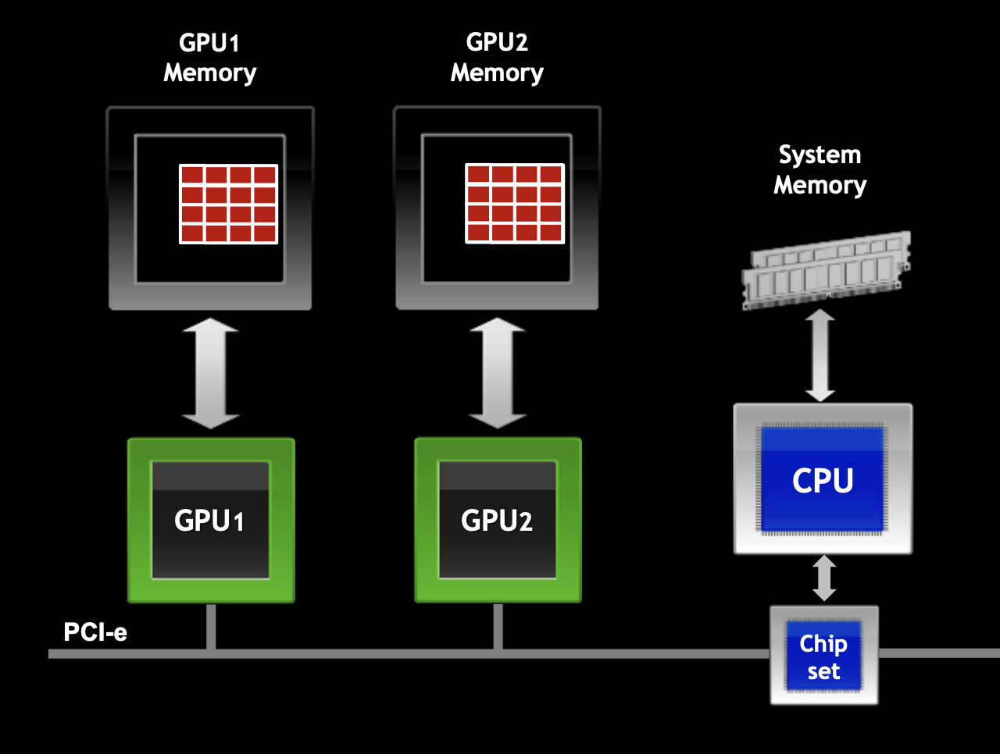

# Hands-On 9: Sample Codes using CUDA-AWARE MPI on Multi-GPU

In most parallel applications it is necessary to carry out communication operations involving multiple computational resources. These communication operations can be implemented through point-to-point operations, however, this approach is not very efficient for the programmer. Parallel and distributed solutions based on collective operations have long been the main choice for these applications. The MPI standard has a set of very efficient routines that perform collective operations, making better use of the computing capacity of available computational resources. Also, with the advent of new computational resources, similar routines appear for multi-GPU systems. This repository will cover the handling of CUDA-AWARE-MPI routines for multi-GPU environments, always comparing them with the MPI standard, showing the differences and similarities between the two computational execution environments.

 

      

     
  

----
## What is CUDA-AWARE MPI?
see [NVIDIA](https://developer.nvidia.com/blog/introduction-cuda-aware-mpi/)

> CUDA-Aware MPI is a implementation must handle buffers differently depending on whether it resides in host or device memory. An MPI implementation could offer different APIs for host and device buffers, or it could add an additional argument indicating where the passed buffer lives. MPI, the Message Passing Interface, is a standard API for communicating data via messages between distributed processes that is commonly used in HPC to build applications that can scale to multi-node computer clusters. As such, MPI is fully compatible with CUDA, which is designed for parallel computing on a single computer or node.
----

## Why Parallel Programming approaches of MPI and CUDA?

There are a number of reasons for wanting to combine the complementary parallel programming approaches of MPI and CUDA:

* To solve problems with a data size too large to fit into the memory of a single GPU;
* To solve problems that would require unreasonably long compute time on a single node;
* To accelerate an existing MPI application with GPUs;
* To enable a single-node multi-GPU application to scale across multiple nodes.

----

## How to Install the CUDA-AWARE MPI

1. Verify if CUDA is available 

> ~$ nvcc --version 

2. Install the Package NVIDIA GDRCopy  

> ~$ wget https://github.com/NVIDIA/gdrcopy/archive/refs/tags/v2.3.tar.gz
    
> ~$ tar -xf v2.3.tar.gz

> ~$ make prefix=<install-to-this-location> CUDA=<cuda-install-top-dir> all install

> ~$ sudo ./insmod.sh

3. Install the UCX 

> ~$ wget https://github.com/openucx/ucx/archive/master.zip

> ~$ unzip master.zip 

> ~$ ./configure --prefix=path-to-install-dir --disable-assertions --disable-debug --disable-doxygen-doc --disable-logging --disable-params-check --enable-mt --enable-optimizations --with-cuda=path-to-cuda --with-gdrcopy=path-to-gdrcopy --with-knem=path-to-knem-melanox --with-rdmacm --with-verbs

> ~$ make -j number-of-processors 

> ~$ make -j number-of-processors install 

4. Install OpenMPI

> ~$ wget https://download.open-mpi.org/release/open-mpi/v4.1/openmpi-4.1.2.tar.gz

> ~$ tar -xf openmpi-4.1.2.tar.gz

> ~$ ./configure --prefix=/opt/share/openmpi/4.0.5-cuda/  --disable-getpwuid --enable-mca-no-build=btl-uct  --enable-orterun-prefix-by-default' --with-cuda=path-to-cuda --with-pmi --with-pmix=internal  --with-ucx=path-to-ucx --with-verbs  --with-knem=path-to-knem-melanox

5. Check Environment infiniBand

> ~$ lspci | grep Mellanox

> ~$ ibstat

> ~$ ibstatus

   * Check if the library was built with CUDA-aware support:
    
    > ~$ ompi_info --parsable --all | grep mpi_built_with_cuda_support:value mca:mpi:base:param:mpi_built_with_cuda_support:value:true

   * See if you have GPUDirect RDMA compiled into your library, you can check like this:
    
     ~$ ompi_info --all | grep btl_openib_have_cuda_gdr MCA btl: informational "btl_openib_have_cuda_gdr" (current value: "true", data source: default, level: 4 tuner/basic, type: bool)

   * See if your OFED stack has GPUDirect RDMA support, you can check like this:
    
    > ~$ ompi_info --all | grep btl_openib_have_driver_gdr

   * Check the UCX CUDA Support 
    
     > ~$ ucx_info -b
    
     > ~$ ucx_info -b | grep CUDA
    
     > ~$ ucx_info -b | grep MLX
    
     > ~$ ucx_info -c
    
     > ~$ ucx_info -c | grep CUDA

----
## Acknowledgements

This work has been partially supported by NVIDIA Hardware Grant Program, and I have also worked in cooperation with the researcher [Silvano Júnior](silvano.junior@fieb.org.br).
    
